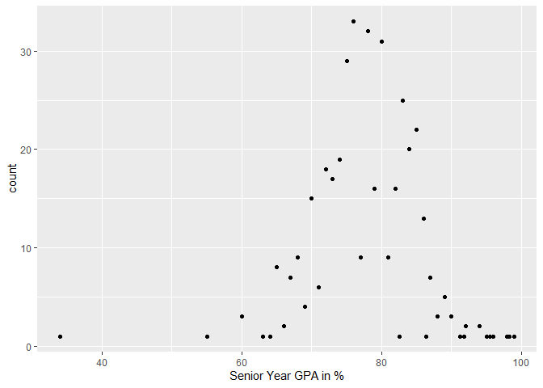
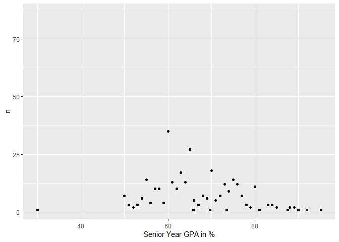
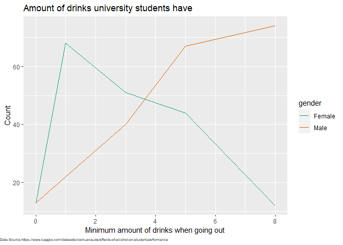
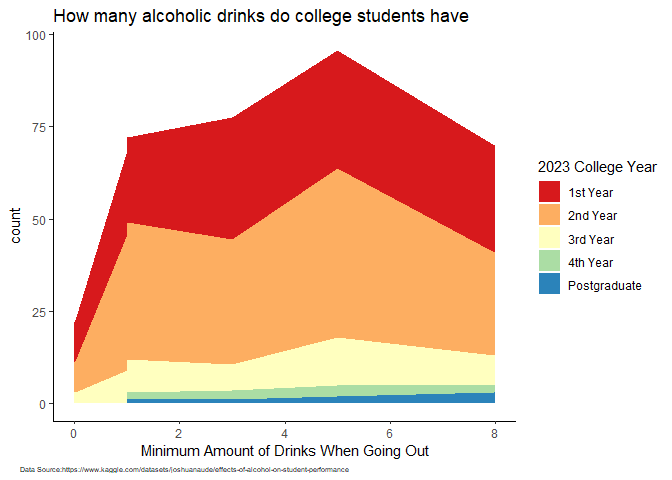
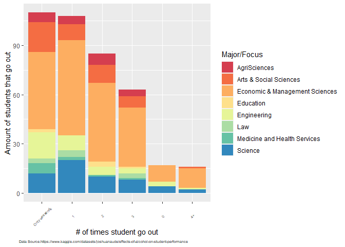

University Students’ Drinking Data
================

``` r
library(tidyr)
```

    ## Warning: package 'tidyr' was built under R version 4.1.3

``` r
library(ggplot2)
```

    ## Warning: package 'ggplot2' was built under R version 4.1.3

``` r
library(dplyr)
```

    ## Warning: package 'dplyr' was built under R version 4.1.3

    ## 
    ## Attaching package: 'dplyr'

    ## The following objects are masked from 'package:stats':
    ## 
    ##     filter, lag

    ## The following objects are masked from 'package:base':
    ## 
    ##     intersect, setdiff, setequal, union

``` r
library(readr)
```

    ## Warning: package 'readr' was built under R version 4.1.3

``` r
library(lubridate)
```

    ## Warning: package 'lubridate' was built under R version 4.1.3

    ## 
    ## Attaching package: 'lubridate'

    ## The following objects are masked from 'package:base':
    ## 
    ##     date, intersect, setdiff, union

``` r
library(stringr)
```

    ## Warning: package 'stringr' was built under R version 4.1.3

``` r
library(forcats)
```

    ## Warning: package 'forcats' was built under R version 4.1.3

Cleaning data: - Renaming variables to make them more workable -
Separating drinks column into minDrinks and maxDrinks and making those
variables numeric

``` r
drinksDS <- read_csv("Stats survey.csv")
```

    ## Rows: 406 Columns: 17
    ## -- Column specification --------------------------------------------------------
    ## Delimiter: ","
    ## chr (15): Timestamp, Your Sex?, What year were you in last year (2023) ?, Wh...
    ## dbl  (2): Your Matric (grade 12) Average/ GPA (in %), Your 2023 academic yea...
    ## 
    ## i Use `spec()` to retrieve the full column specification for this data.
    ## i Specify the column types or set `show_col_types = FALSE` to quiet this message.

``` r
drinksDS %>% 
  variable.names()
```

    ##  [1] "Timestamp"                                                                                        
    ##  [2] "Your Sex?"                                                                                        
    ##  [3] "Your Matric (grade 12) Average/ GPA (in %)"                                                       
    ##  [4] "What year were you in last year (2023) ?"                                                         
    ##  [5] "What faculty does your degree fall under?"                                                        
    ##  [6] "Your 2023 academic year average/GPA in % (Ignore if you are 2024 1st year student)"               
    ##  [7] "Your Accommodation Status Last Year (2023)"                                                       
    ##  [8] "Monthly Allowance in 2023"                                                                        
    ##  [9] "Were you on scholarship/bursary in 2023?"                                                         
    ## [10] "Additional amount of studying (in hrs) per week"                                                  
    ## [11] "How often do you go out partying/socialising during the week?"                                    
    ## [12] "On a night out, how many alcoholic drinks do you consume?"                                        
    ## [13] "How many classes do you miss per week due to alcohol reasons, (i.e: being hungover or too tired?)"
    ## [14] "How many modules have you failed thus far into your studies?"                                     
    ## [15] "Are you currently in a romantic relationship?"                                                    
    ## [16] "Do your parents approve alcohol consumption?"                                                     
    ## [17] "How strong is your relationship with your parent/s?"

``` r
drinksDS_clean <- drinksDS %>% 
  rename(gender = "Your Sex?", 
         collegeYear2023 = "What year were you in last year (2023) ?", 
         grade12GPA = "Your Matric (grade 12) Average/ GPA (in %)", 
         major = "What faculty does your degree fall under?", 
         "2023GPA" = "Your 2023 academic year average/GPA in % (Ignore if you are 2024 1st year student)", 
         accomodationStatus2023 = "Your Accommodation Status Last Year (2023)", 
         monthlyAllowance2023 = "Monthly Allowance in 2023", 
         scholarship2023 = "Were you on scholarship/bursary in 2023?", 
         studyTime = "Additional amount of studying (in hrs) per week", 
         partyTime = "How often do you go out partying/socialising during the week?", 
         drinks = "On a night out, how many alcoholic drinks do you consume?", 
         missedClasses = "How many classes do you miss per week due to alcohol reasons, (i.e: being hungover or too tired?)", 
         failedModules = "How many modules have you failed thus far into your studies?", 
         relationshipStatus = "Are you currently in a romantic relationship?", 
         parentApproval = "Do your parents approve alcohol consumption?", 
         parentRelationship = "How strong is your relationship with your parent/s?") %>% 
  separate(drinks, c("minDrinks", "maxDrinks"), sep = "-", remove = FALSE, convert = TRUE) %>% 
  mutate(minDrinks = as.numeric(str_remove(minDrinks, "\\+"))) %>% 
  select(-Timestamp) %>% 
  as_tibble()
```

    ## Warning: Expected 2 pieces. Missing pieces filled with `NA` in 112 rows [1, 3, 4, 12,
    ## 21, 26, 28, 36, 38, 43, 55, 58, 67, 70, 74, 79, 80, 82, 95, 96, ...].

Quick glimpse of data: Variables, Datetypes, descriptive statistics….

``` r
drinksDS_clean %>% 
  summary()
```

    ##     gender            grade12GPA    collegeYear2023       major          
    ##  Length:406         Min.   :34.00   Length:406         Length:406        
    ##  Class :character   1st Qu.:74.00   Class :character   Class :character  
    ##  Mode  :character   Median :78.00   Mode  :character   Mode  :character  
    ##                     Mean   :77.99                                        
    ##                     3rd Qu.:83.00                                        
    ##                     Max.   :99.00                                        
    ##                     NA's   :7                                            
    ##     2023GPA      accomodationStatus2023 monthlyAllowance2023 scholarship2023   
    ##  Min.   :30.00   Length:406             Length:406           Length:406        
    ##  1st Qu.:60.00   Class :character       Class :character     Class :character  
    ##  Median :65.00   Mode  :character       Mode  :character     Mode  :character  
    ##  Mean   :66.27                                                                 
    ##  3rd Qu.:73.00                                                                 
    ##  Max.   :95.22                                                                 
    ##  NA's   :86                                                                    
    ##   studyTime          partyTime            drinks            minDrinks    
    ##  Length:406         Length:406         Length:406         Min.   :0.000  
    ##  Class :character   Class :character   Class :character   1st Qu.:1.000  
    ##  Mode  :character   Mode  :character   Mode  :character   Median :3.000  
    ##                                                           Mean   :3.975  
    ##                                                           3rd Qu.:5.000  
    ##                                                           Max.   :8.000  
    ##                                                           NA's   :2      
    ##    maxDrinks     missedClasses      failedModules      relationshipStatus
    ##  Min.   :3.000   Length:406         Length:406         Length:406        
    ##  1st Qu.:3.000   Class :character   Class :character   Class :character  
    ##  Median :5.000   Mode  :character   Mode  :character   Mode  :character  
    ##  Mean   :5.524                                                           
    ##  3rd Qu.:8.000                                                           
    ##  Max.   :8.000                                                           
    ##  NA's   :114                                                             
    ##  parentApproval     parentRelationship
    ##  Length:406         Length:406        
    ##  Class :character   Class :character  
    ##  Mode  :character   Mode  :character  
    ##                                       
    ##                                       
    ##                                       
    ## 

Counts of majors: This data is heavily skewered towards Economic &
Management Sciences majors

``` r
drinksDS_clean %>% 
  count(major)
```

    ## # A tibble: 9 x 2
    ##   major                              n
    ##   <chr>                          <int>
    ## 1 AgriSciences                      22
    ## 2 Arts & Social Sciences            47
    ## 3 Economic & Management Sciences   211
    ## 4 Education                          6
    ## 5 Engineering                       37
    ## 6 Law                               10
    ## 7 Medicine and Health Services      10
    ## 8 Science                           56
    ## 9 <NA>                               7

Counts of gender (Male/Female): Data collected from mostly males

``` r
drinksDS_clean %>%
  count(gender)
```

    ## # A tibble: 3 x 2
    ##   gender     n
    ##   <chr>  <int>
    ## 1 Female   188
    ## 2 Male     216
    ## 3 <NA>       2

Counts of grade level in 2023

``` r
drinksDS_clean %>% 
  count(collegeYear2023)
```

    ## # A tibble: 6 x 2
    ##   collegeYear2023     n
    ##   <chr>           <int>
    ## 1 1st Year          128
    ## 2 2nd Year          153
    ## 3 3rd Year           40
    ## 4 4th Year            7
    ## 5 Postgraduate        5
    ## 6 <NA>               73

``` r
drinksDS_clean %>% 
  count(accomodationStatus2023)
```

    ## # A tibble: 3 x 2
    ##   accomodationStatus2023                              n
    ##   <chr>                                           <int>
    ## 1 Non-private accommodation ie. Res                  48
    ## 2 Private accommodation/ stay with family/friends   335
    ## 3 <NA>                                               23

Count of how many times students go out per week Students seem to go out
mostly on weekends

``` r
drinksDS_clean %>% 
  count(partyTime, sort = TRUE)
```

    ## # A tibble: 7 x 2
    ##   partyTime         n
    ##   <chr>         <int>
    ## 1 Only weekends   113
    ## 2 1               108
    ## 3 2                87
    ## 4 3                63
    ## 5 0                17
    ## 6 4+               16
    ## 7 <NA>              2

Count of Students’ monthly allowance

``` r
drinksDS_clean %>% 
  count(monthlyAllowance2023)
```

    ## # A tibble: 6 x 2
    ##   monthlyAllowance2023     n
    ##   <chr>                <int>
    ## 1 R 4001- R 5000         159
    ## 2 R 5001 - R 6000        101
    ## 3 R 6001 - R 7000         58
    ## 4 R 7001 - R 8000         30
    ## 5 R 8000+                 27
    ## 6 <NA>                    31

Count of Students’ relationship status

``` r
drinksDS_clean %>% 
  count(relationshipStatus)
```

    ## # A tibble: 3 x 2
    ##   relationshipStatus     n
    ##   <chr>              <int>
    ## 1 No                   239
    ## 2 Yes                  164
    ## 3 <NA>                   3

``` r
drinksDS_clean %>% 
  count(failedModules)
```

    ## # A tibble: 6 x 2
    ##   failedModules     n
    ##   <chr>         <int>
    ## 1 0               263
    ## 2 1                58
    ## 3 2                31
    ## 4 3                24
    ## 5 4+               27
    ## 6 <NA>              3

Parent Approval

``` r
drinksDS_clean %>% 
  count(parentApproval)
```

    ## # A tibble: 3 x 2
    ##   parentApproval     n
    ##   <chr>          <int>
    ## 1 No                49
    ## 2 Yes              353
    ## 3 <NA>               4

Distribution of GPA in Senior Year of high school

``` r
drinksDS_clean %>% 
  group_by(grade12GPA) %>% 
  summarise(count = n()) %>% 
  ggplot() + 
  geom_point(aes(grade12GPA, count)) + 
  labs(x = "Senior Year GPA in %") 
```

    ## Warning: Removed 1 rows containing missing values (`geom_point()`).

<!-- -->
Distribution of GPA for 2023 college year

``` r
drinksDS_clean %>% 
  count(`2023GPA`) %>% 
  ggplot() + 
  geom_point(aes(`2023GPA`, n)) + 
  labs(x = "Senior Year GPA in %")
```

    ## Warning: Removed 1 rows containing missing values (`geom_point()`).

<!-- -->
Run Chi Sq test to see if we have a difference between Males and
Females. We cannot reject the null hypothesis

``` r
drinksDS_clean %>%
  count(gender)
```

    ## # A tibble: 3 x 2
    ##   gender     n
    ##   <chr>  <int>
    ## 1 Female   188
    ## 2 Male     216
    ## 3 <NA>       2

``` r
studentGender <- drinksDS_clean %>%
  select(gender) %>% 
  filter(gender %in% c("Female", 
                       "Male")) %>% 
  mutate(gender = fct_drop(gender))

studentGender_table <- table(studentGender)
View(studentGender_table) 

chisq.test(studentGender_table)
```

    ## 
    ##  Chi-squared test for given probabilities
    ## 
    ## data:  studentGender_table
    ## X-squared = 1.9406, df = 1, p-value = 0.1636

How many drinks do different gender have when going out

``` r
drinksDS_clean %>% 
  group_by(gender) %>% 
  filter(gender != is.na(gender)) %>% 
  count(gender, minDrinks) %>% 
  ggplot(aes(minDrinks, n, color = gender)) +
  geom_line() +
  labs(x = "Minimum amount of drinks when going out", 
       y = "Count", 
       title = "Amount of drinks university students have", caption = "Data Source:https://www.kaggle.com/datasets/joshuanaude/effects-of-alcohol-on-student-performance") + 
  theme(plot.caption = element_text(size = 5, hjust = -.25))+
  scale_color_brewer(palette = "Dark2")
```

<!-- -->

How many drinks do different college year students have when going out
\#Removed Missing Data

``` r
drinksDS_clean %>% 
  select(collegeYear2023, `2023GPA`, major, grade12GPA, studyTime, partyTime, minDrinks) %>% 
  group_by(collegeYear2023, minDrinks) %>% 
  filter(collegeYear2023 != is.na(collegeYear2023)) %>% 
  summarise(count = n()) %>% 
  ggplot() + 
  geom_area(aes(minDrinks, count, fill = collegeYear2023)) + 
  theme_classic() +
  labs(x = "Minimum Amount of Drinks When Going Out", fill = "2023 College Year", title = "How many alcoholic drinks do college students have", caption = "Data Source:https://www.kaggle.com/datasets/joshuanaude/effects-of-alcohol-on-student-performance") + 
  theme(plot.caption = element_text(size = 5, hjust = -.25)) +
  scale_fill_brewer(palette = "Spectral")
```

    ## `summarise()` has grouped output by 'collegeYear2023'. You can override using
    ## the `.groups` argument.

<!-- -->

How many times a week do different major go out

``` r
drinksDS_clean %>%
  group_by(partyTime, major) %>%
  filter(major != is.na(major)) %>% 
  count(partyTime, major, sort = TRUE) %>% 
  ggplot(aes(fct_reorder(partyTime, n, .fun = sum, .desc = TRUE), n, fill = major)) + 
  geom_col() + 
  labs(x = "# of times student go out", 
       y = "Amount of students that go out", 
       fill = "Major/Focus",
  caption = "Data Source:https://www.kaggle.com/datasets/joshuanaude/effects-of-alcohol-on-student-performance") + 
  theme(plot.caption = element_text(size = 5, hjust = -.25),
        axis.text.x = element_text(angle = 45, size = 5, vjust = .5))+
  scale_fill_brewer(palette = "Spectral")
```

<!-- -->

How many drinks do different majors have when going out

``` r
drinksDS_clean %>% 
  filter(partyTime == "Only weekends", 
         major != is.na(major)) %>%  
  count(major, minDrinks) %>% 
  mutate(minDrinks = reorder(minDrinks, n, FUN = sum)) %>% 
  ggplot(aes(minDrinks, n, fill = major)) + 
  geom_col(aes()) + 
  labs(title = "How many drinks do different major have on the weekends", 
       x = "Minimum amount of drinks", 
       y = "count", 
       caption = "Data Source:https://www.kaggle.com/datasets/joshuanaude/effects-of-alcohol-on-student-performance")+
  theme(plot.caption = element_text(size = 5, hjust = -.25),
        axis.text.x = element_text(angle = 45, size = 5, vjust = .5))+
  scale_fill_brewer(palette = "Spectral")
```

<!-- -->
